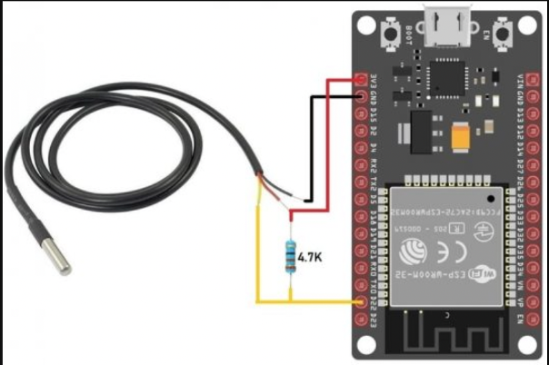
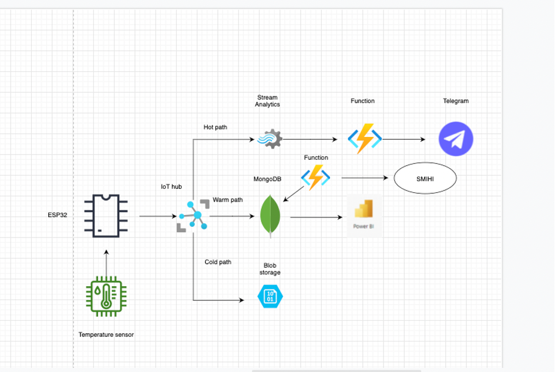

# IoT_Cloud_Demo
## Bakgrund:

Vi är en familj på 6 personer hemma, 3 pojkar och en tjej mellan åldrarna 11–4.
En nyckelfaktor i att hinna med allas aktiviteter, matcher, socialt liv både för oss och barnen är planering. Detta är extremt viktigt och kritiskt för oss och andra familjer. Som småbarnsföräldrar vill man såklart laga bra och fräsch, färska råvaror, gärna i större mängder så man slipper stå vid köket dag in och ut. 

Detta kan dock medföra med en hel del svinn, lägg på jobb, skola och andra faktorer för både mig och min fru så känner man ibland att tiden inte tiden räcker ut och ibland händer det att vi tyvärr får slänga en del mat. 

Målet med detta projekt är att få en bättre förståelse i hur vi bör hantera livsmedel kopplat till temperaturen i kylen, både mat generellt men även tillagad mat för att minska svinn.

## Överblick
Detta projekt demonstrerar hur man kan använda en DS18B20-temperaturgivare för att mäta temperaturen i ett kylskåp och skicka dessa data till en Azure IoT-hubb. Därefter lagras data i en Cosmos DB-databas och presenteras i Power BI.

## Krav
För att kunna använda detta projekt behöver du följande:

- En ESP32-enhet
- En DS18B20-temperaturgivare
- En Azure IoT-hubb
- En Cosmos DB-databas
- Power BI

## Tillvägagångssätt:
Sensor placeras i kylskåpet och skickas in genom att. 

Lösning/hårdvara:

Esp32 – Denna placeras ovanför kylen och temperatursensor dras in till kylen för mätning.
Temperatur sensor – DS 18B20 

Varje DS18B20 temperatursensor har en unik 64-bitars seriell kod. Detta gör att du kan koppla flera sensorer till samma datakabel. Så du kan få temperatur från flera sensorer med bara en digital pin.

	
1. Anslut DS18B20-givaren till ESP32-enheten enligt instruktionerna i givarens dokumentation.
2. Anslut ESP32-enheten till ditt lokala nätverk och konfigurera den att ansluta till din Azure IoT-hubb.
3. Skapa en Cosmos DB-databas och konfigurera din Azure IoT-hubb att skicka data till den.
4. Använd Power BI för att visualisera data från Cosmos DB.

Flödesschema:

 

## Komponenter:

- Esp32 – Denna placeras ovanför kylen och temperatursensor dras in till kylen för mätning.

- Temperatur sensor – DS 18B20 

    - Varje DS18B20 temperatursensor har en unik 64-bitars seriell kod. Detta gör att du kan koppla flera sensorer till samma datakabel. Så du kan få temperatur från flera sensorer med bara en digital pin.

- IoT Hub – Azure

- MongoDB atlas – Multi – cloud databas service. Förenklar bade utrullningen/deploy:andet och hur man hanterar sin databas on-demand. När man än kan tänkas behöva det.
I detta fallet så hämtar jag datat från IoT hubben som skickades ifrån espn32. 

- Power Bi – Datavisulisering, bi vertyg. Här väljer jag PowerBi för att visualisera min data för att kunna tolka dem värdena som jag har på ett snyggt och enkelt sätt.

- Smhi – Här väljer jag att hämta data från SMHI för att se det går att hämta ut det till mongodbatlas. Detta för att ha ett liknande dataunderlagt då de består av temperatur och det är något jag mäter/använder mig utav i detta projekt.

- Blob storage – Container, för att långtidsspara min data.

## Avslutning
Med hjälp av detta projekt kan du enkelt mäta temperaturen i ett kylskåp och spara data till molnet. Detta kan användas för att övervaka temperaturen i kylskåpet och förhindra att livsmedel blir dåliga.
